[TOC]

# CH1. Introduction 111

## Q1. What is Big data?

> **Big datais a buzzword, or catch-phrase, used to describe a massive volume of both structured and unstructured data that is so large that it's difficult to process using traditional database and software techniques**

## Q2. four feature of Big data

- **volume：scale of data**
- **variety：different forms of data**
- **velocity：analysis of streaming data**
- **veracity：uncertainty of data**

## Q3. What is data mining?

>  **consists of applying data analysis and discovery algorithms that, under acceptable computational efficiency limitations, produce a particular enumeration of patterns over the data**

## Q4. The main tasks of data mining?

- **Association Rule Mining：4G transfer analysis**
- **Cluster Analysis：Fiber clustering**
- **Classification/Prediction：AD Prediction**
- **Outline Detection：NBA Players analysis**

## Q5. The challenges of Big data mining

- **Curse of dimensionality**
- **Storage cost**
- **Query speed** 

---

# CH2. Basics of Data mining

## 一. Basic concepts

### 1. supervised/unsupervised/semi-sup

### 2. Overfitting(Reason?)/underfitting(How to handle it?) problem

### 3. loss of function

## 二. Typical classfication Algo

### 1. Desicion Tree

1. How to select Attribution
   - Information gain(ID3)
   - Information Gain Ratio(C4.5)
   - Gini index(CART)
  2. Benifits of DT
     - easy to understand and explain, can be visualized and analyzed, and it is easy to extract rules
     - Ability to deal with irrelevant features
     - When testing the data set, the running speed is relatively fast
  3. How to avoid overfitting in DT?
     - Limit the number of nodes or height in the tree
     - Reasonable and effective sampling
     - Prune first or post pruning

### 2. KNN->lazy learning

1. Basic Idea

2. Benifits and drawbacks

   eg. 

   - easy to implement
   - local fashion
   - multi-class/incremental learning

   eg. 

   - sensitive to k
   - class 
   - predicion(slow)->怎么处理

### 3. Naive Bayes -> Probability output

1. basic idea: Bayes theorem

### 4. SVM(了解概念)

> **The goal is to find an optimal separation hyperplane to reduce the error rate of classification (for new data) as much as possible. Intuitively speaking, it is hoped that the distance between the samples in the data set and the hyperplane is as far away as possible.(目标是找到一个最优的分离超平面，尽可能地降低(对新数据)分类的错误率。直观的讲，就是希望数据集中的样本离这个超平面的距离越远越好)**

- Basic idea: Margin Maximization 间隔最大化

  > **Finding the hyperplane with the largest geometric interval for the training data set means to classify the training data with sufficient confidence(对训练数据集找到几何间隔最大的超平面意味着以充分大的确信度对训练数据进行分类)**
- support vectors

- Good generalization : Structural task

- High-Dimension: Kernel trick(Non-linear problem 线性不可分问题)

  > **Transform the original input data into a higher dimensional space**,separation may be easier in higher dimensions,by applying kernel function to  the original data

### 5. Ensemble Learning（集成学习）工业

- Criteria: good base learner + diversity

  > **Generate a group of base-learners which when combined have higher accuracy**

- Strategy：Bagging(Random Forest)

  > **Ensemble consisting of a bagging of un-pruned decision tree learners with a randomized selection of features at each split,average the predictions of the trees for a new query (or take majority vote)**

- Strategy：Boosting(Ado.Boost/XG Boost/LightGBM)

  > **A new classifier should focus on those cases which were incorrectly classified in the last round,Each classifier is “weak” but the ensemble is “strong.”**

  1. **Original training set: equal weights to all training samples**
  2. **Ado.Boost：Update the weight distribution, but add a normalization factor to make the weight meet the probability distribution(更新权值分布，不过加了归一化因子，使权值满足概率分布)**

- Strategy：Stacking-> 人工神经网络

  > **Use the training set to train to obtain multiple primary learners, and then use the primary learner to predict the test set, and use the output value as the input value for the next stage of training, and the final label as the output value for training the secondary learner(利用训练集训练得到多个初级学习器，然后用初级学习器对测试集进行预测，并将输出值作为下一阶段训练的输入值，最终的标签作为输出值，用于训练次级学习器)**

  

## 三. Clustering Algo

### 1. K-Means

* Basic idea
* Potention Problems

### 2. DBSCAN

- Density-based notion
- Benefits of

---

# CH3. Hashing

## 一. The role of Hashing

- dimension reduction
- fast query

## 二. K-shingles

> **convert documents, emails, etc., to sets.**

    
  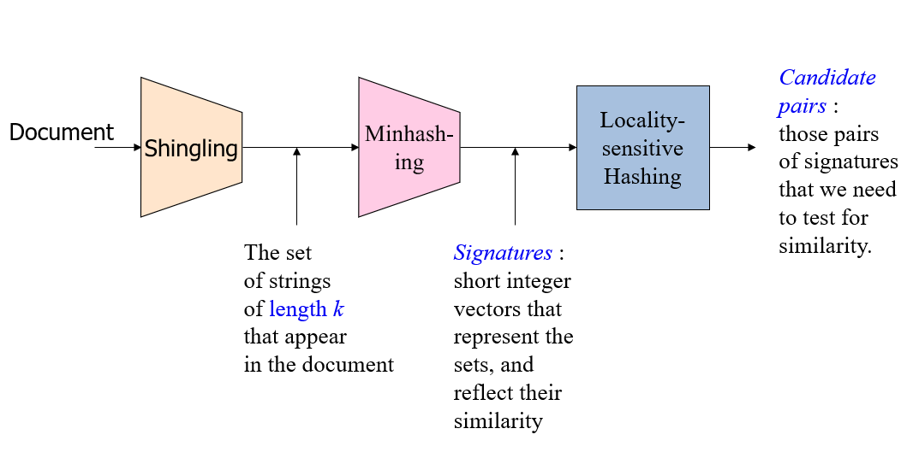

> ***k-shingle (or k -gram) for a document is a sequence of k characters that appears in the document,represent a doc by its set of k-shingles，k = 5 is OK for short documents; k = 10 is better for long documents** 

## 三. Min-Hash

- What is Min-Hash

  	1. hash each column *C* to a small *signature* *Sig* (C), such that
   	2. When the sets are so large or so many that they cannot fit in main memory.
   	3. *Sig* (C) is small enough that we can fit a signature in main memory for each column
   	4. *Sim* (C1, C2) is the same as the “similarity” of *Sig* (C1) and *Sig* (C2).

  

- How to use Min-Hash to compute（Signatur Matrix）

  1. *Sim* (C1, C2) = *a* /(*a* +*b* +*c* ).

  2. 
    
       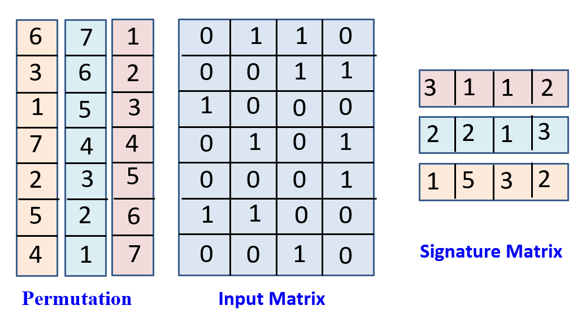
     

  3. h (C1) = h (C2) is the same as Sim (C1, C2)

  4. 
    
       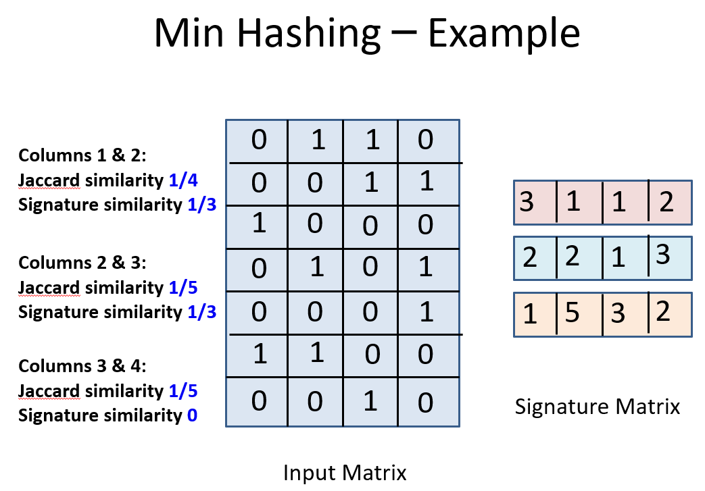
     

- Approxization 

## 四. locality-sensitive Hash (计算、概念)

- trick: divides signature rows  into many bands
- Each hash function based on one band
- hash columns of signature matrix *M* several times
- Arrange that (only) similar columns are likely to hash to the same bucket
- Candidate pairs are those that hash at least once to the same bucket

    
  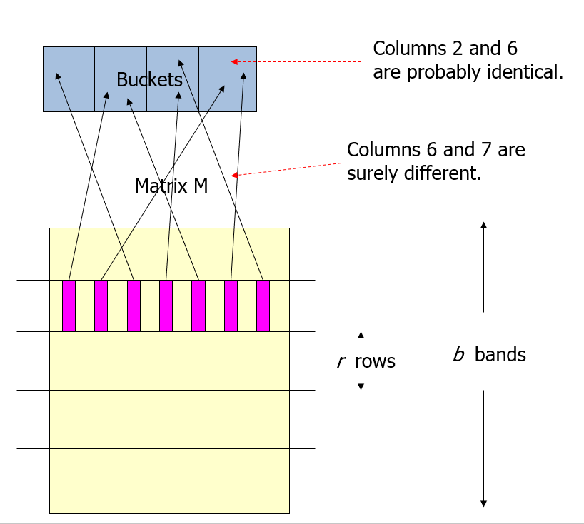

---

# CH4. Sampling 

**Given a known pdf draw some samples from pdf**

## 一. Inverse Sampling

- pdf -> cdf -> F-1(P)
- **drawbacks：it’s hard to get the inverse function**

## 二. Rejection sampling

- procedure

  
    
    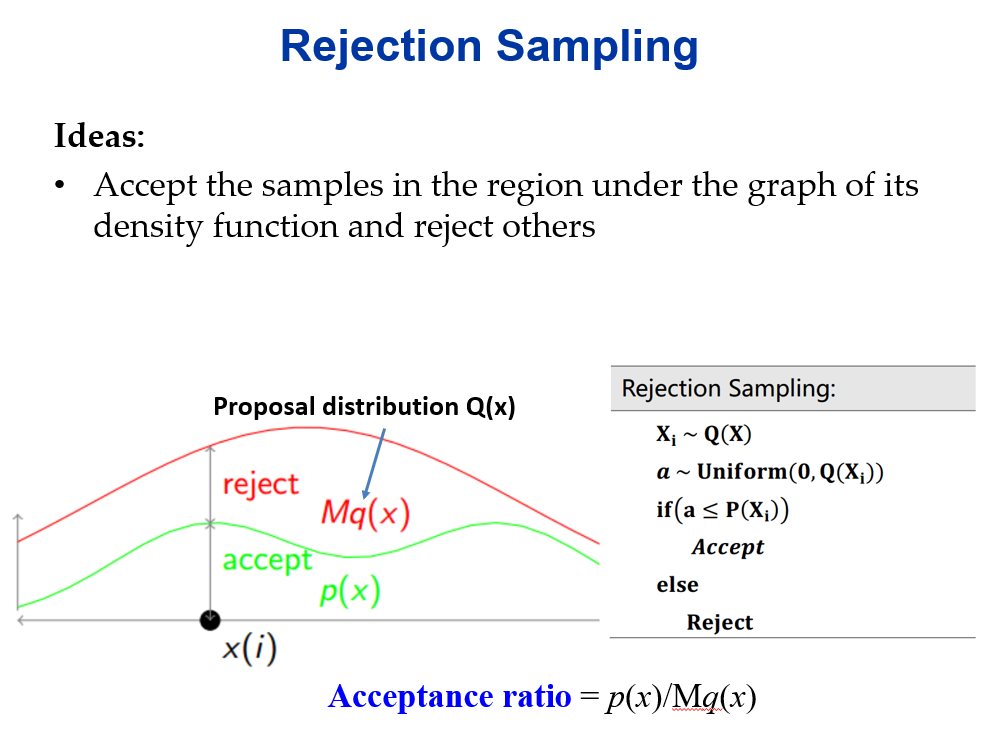
  

- **drawbacks：Acceptance Ratio is low**

## 三. Importance Sampling -> E(f(x))

- Not reject but **assign weight** to each instance so that the correct distribution is targeted
- Importance Sapmling VS Rejection Sampling
  1. Instances from RS share the **same “weight”,** only some of instances are reserved
  2. Instances from IS **have different weight**, all instances are reserved
  3. IS is less sensitive to proposal distribution 

## 四. MCMC

- How to construct Markow Properties

  1. Utilize MCMC to generate a Markov chain, such that we have a Markov chain  {X1,X2,...,Xi,Xi+1,Xn}
  2. if n  is large enough ,Xn~p(X)

- detailed balance condition

  
    
    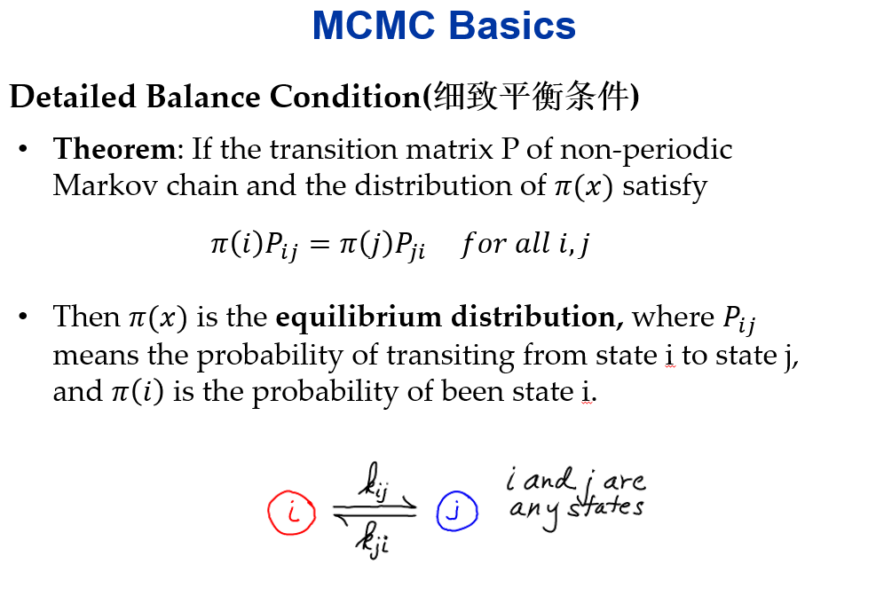
  

## 五. Other Sampling

- MCMC Sampling
  **q(x,y)表示从状态x转移到状态y，或者也可以写成q(y|x)**

  
    
    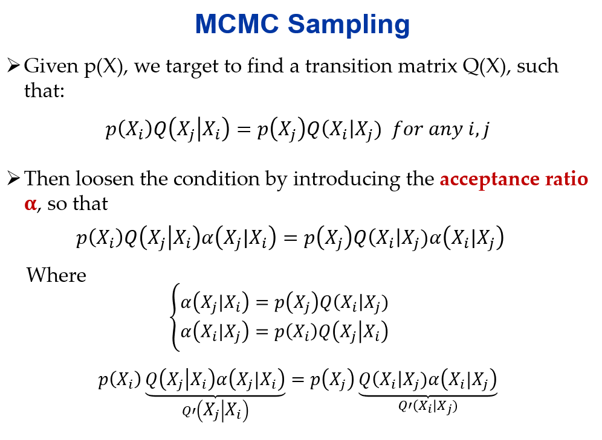
  

  
  
    
    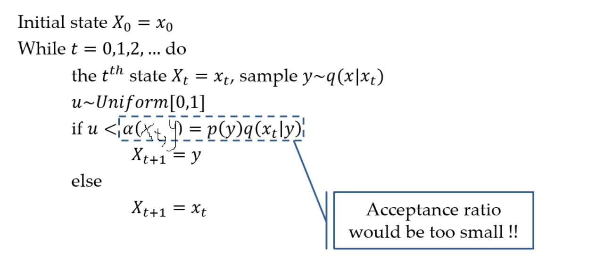
  

  
- MH Sampling

  - **MCMC sampling中a(i,j)可能偏小，导致采样过程中Markov Chain原地踏步，收敛到p(x)太慢**

  - Magnify acceptance ratio by(将a(i,j)和a(j,i)同比例放大) ,but doesn't have a 100% acceptance rate

  - Acceptance threshold would be very crucial

  - Doesn’t require to know the full conditionals 

  - 
    
      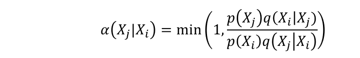
    

- Gibbs Sampling

  - MH has large acceptance ratio, but Gibbs sampling further make acceptance ratio being 100% 
  - Need to know the full conditionals 

---

# CH5. Data Stream Mining

## 一. What is data stream?

> **A data stream is a massive sequence of data objects which have some unique features**

## 二. Unique properties of Data Stream

- **One by one**
- **potentially unbounded**
- **Concept drift**

## 三. Challenge of Data Stream Mining 

- Infinite length
- evolving nature
- single pass handling
- memory limitation
- low time complexity
- concept drift

## 四. Concept drift Detection

- What is Concept drift

  > **concept drift means that the statistical properties of the target variable, which the model is trying to predict, change over time in unforeseen ways.**
  > **In a word, the probability distribution changes,in p(C)/P(X)/P(C|X)**
  > (指的就是一个模型要去预测的一个**目标变量**，概念漂移就是这个目标变量随着**时间**的推移发生改变)

- Detection methods

  1. distribution based detector (Adwin Algo->Problems)

     - **若最新窗口w中两个足够大的子窗口w和wz可以展示足够明显的平均数，并且可以推断出相应的预测值是 不同的，则窗 口中较旧的部分可以删除。其中足够大和足够明显可以用 Hoeffding边界定义**
  
     - Hard to determine window size
     - Learn concept drift slower
     - Virtual concept drift
  
  2. error based(监听错误率) (DDM，ECDD->Problems)
  
     - **Capture concept drift based on the change of the classification performance**
     - Sensitive to noise
     - Hard to deal with gradual concept drift
     - Depend on learning model itself heavily

## 五. Data Stream classification

- VFDT：doesn't have concept drift(了解)

  - Disk-based decision tree learners repeatedly read training data from disk sequentially

  - **Goal**: design decision tree learners that read each example at most once, and use a small constant time to process it

  - **Overview：**A decision-tree learning system based on the **Hoeffding tree algorithm**

  - **Hoefffding bond**：
  
    - Let G(X) be the heuristic measure used to choose test attributes (e.g. **Information Gain, Gini Index**)
  - Based on **Hoeffding Bound principle**, classifying different samples leads to the same model with high probability —can use a small set of samples
    
  - 
    
  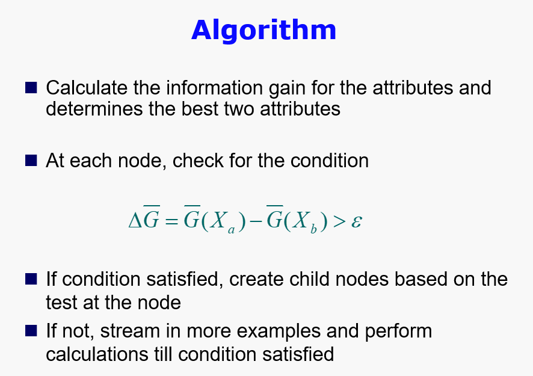
    

    
	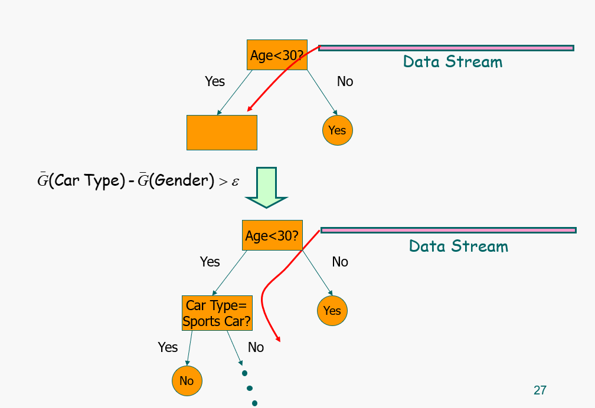

- **Weakness：**
  
  > 1. Could spend a lot of time with ties
    > 2. Memory used with tree expansion
    > 3. Number of candidate attributes
  
  - **Strengths：**
  
    > 1. Scales better than traditional methods
    > 2. Incremental
- CVFDT(procedure)

- Sync Stream

## 六. Data Stream Clustering

- Framework

  
    
  	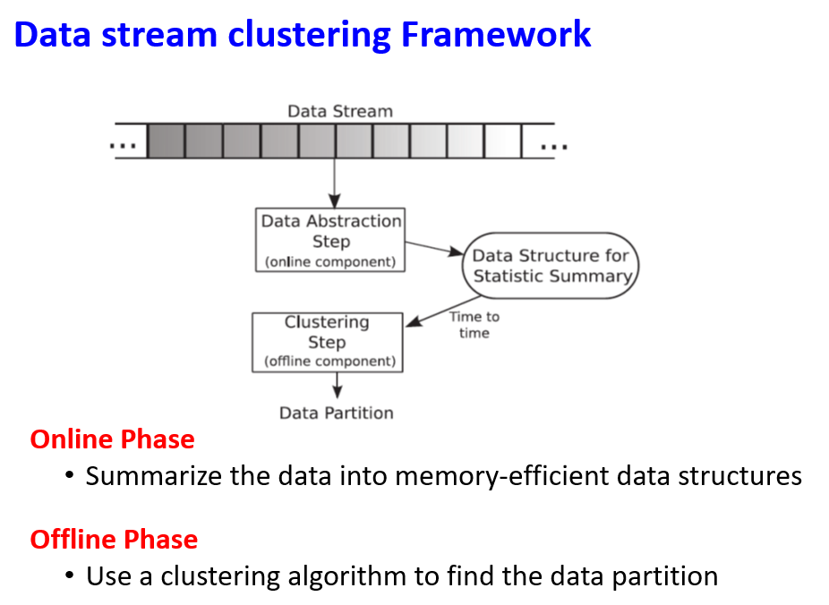
  

  
  1. online Phase(Data Abstraction)
  2. offline Phase(DBSCAN)
  
- online data abstraction：Summarize the data into memory-efficient data structures

  - cluster feature（簇特征）-> CF=（N，LS，SS） -> Micro-cluster
  
- cluster feature：clustream

  - **Key Point: Additivity Property**

  - pyramidal time frame

    > - **Decide at what moments the snapshots of the statistical information are stored away on disk**
    > - **Snapshots of a set of micro-clusters are stored following the pyramidal pattern**
    > - **Snapshots are classified into different orders varying from 1 to log(T)**
    > - **Only the last (α + 1) snapshots are stored** 
    
    
    
    	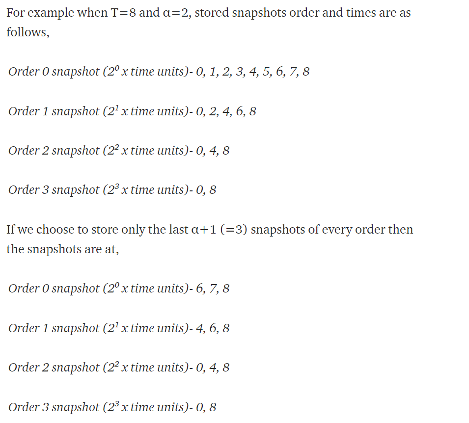
    

- Offline phase：Query-based marco-clustering

  > **Based on a user-specified time-horizon *h* and the number of macro-clusters *k*, compute macroclusters using the *k*-means algorithm** 

- DenStream

  > **Microclusters are associated with weights (Decay function) based on recency**

---

# CH6. Graph Mining

## 一. key node identification

- centrality

  
    
    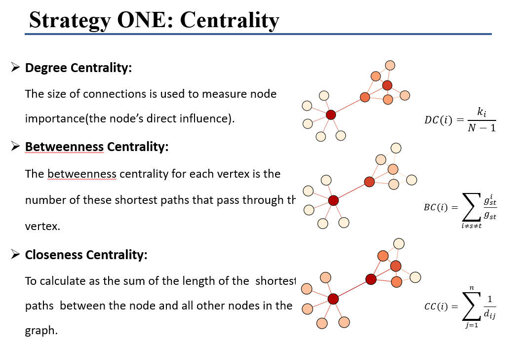
  

- K-shell decompetition

  - **Advantage：**

    1. Low computational complexity

    2. Reveal the hierarchy structure clearly

  - **Disadvantage：**

    1. Can’t be used in quite a lot networks, such as the star network, tree and so on
    2. Too coarse, some times is inferior to degree measure

- page-rank

  -  Basic idea

    
    
      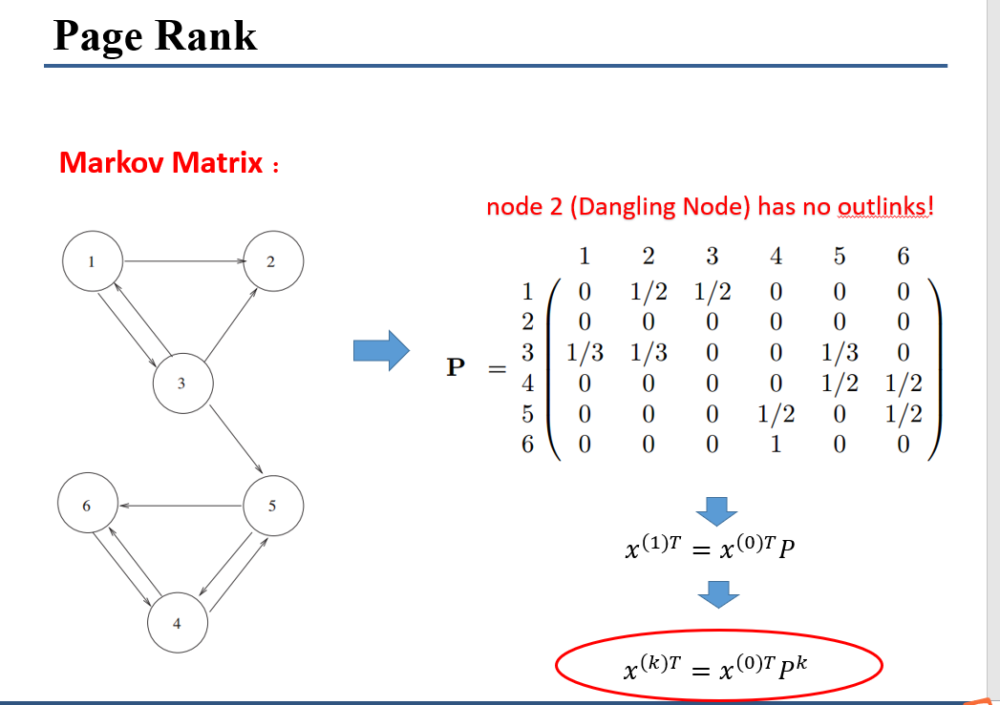
    

  

## 二. Community detection (So important &&简答题)  

**How can we find intrinsic community structure in large scale networks**?

- Minimum Cut

  > **find a graph partition such that the number of edges between the two sets is minimized**

- Ratio Cut && Normalized Cut 

  > **Change the objective function to consider community size,
  > both ratio cut and normalized cut prefer a balanced partition**

  
    
    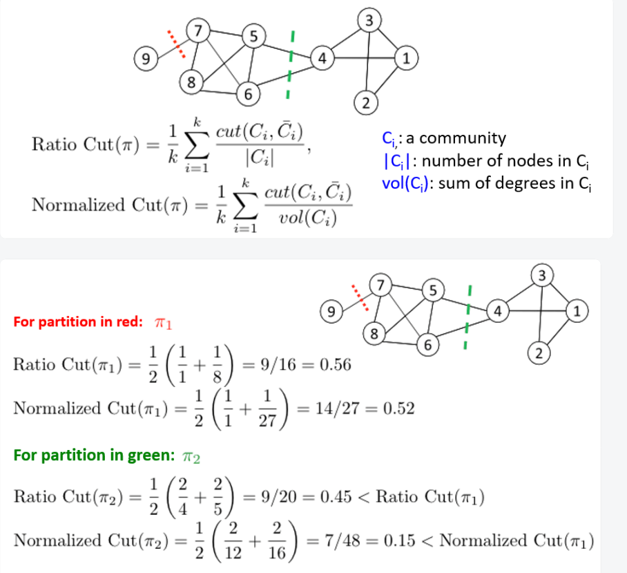
  

- Cut problem to Spectral Clustering

  - **centered matrix：L~（graph Laplacian）**

  - **A：邻接矩阵**

    
    
      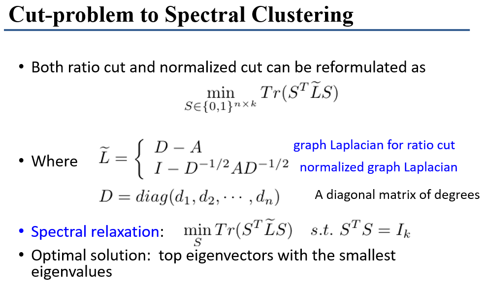
    

  - **Optimal solution: top eigenvectors with the smallest eigenvalues**

- modularity -> Expected Cut（简答）

  - Modularity maximization

    - **Given a network with m edges, the expected number of edges between two nodes with degrees di and dj  is  didj/2m**

    - **Modularity measures the strength of a community partition by taking into account the degree distribution**

    - 
    
        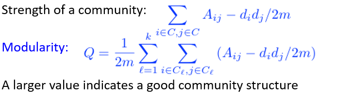
      

  - **centered matrix：B（Modularity Matrix）**  

    - 
    
        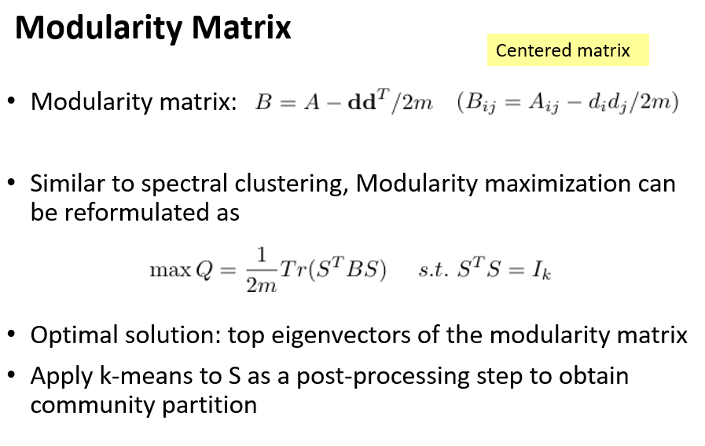
      

- Attractor <- distance dynamics

  - Basic Idea

    > **Simulate the change of edge distances**

  - Simulate the distance dynamics based on different interaction patterns (Distance dynamics vs. Node dynamics) 

  - All edge distances will converge, and the community structure is intuitively identified.     

## 三. Graph Embedding (简单的)

- **Goal：The goal of graph embeddings is to map each node into a low-dimensional space**

- **Graph (non-Euclidean) properties：**
  - Node numbering is arbitrary
  - Graphs has arbitrary size
  - More complex structure
  
- **Challenges：**
  - Measure the similarity between nodes（节点之间的相似性表示链接强度）
  - Encode network information and generate node representation (编码网络信息并生成节点表示)
  
- word2vec(**将单词转换为嵌入向量的嵌入方法**)

  1. CBOW：predicts the current word using surrounding contexts
  2. Skip-Gram model：predicts surroundingg contexts using the current word

- **Deep Walk**

  - **Basically it is a combination of sampling on the graph by random walk + word2vec**

  - **Motivation：**a transfer from language model to network model

  - 
    
    
    

- Node2vec：generate a bias random walk

  - **Basic Idea：**Learn node embedding such that nearby nodes are close together.
  - **Goal：**Find embedding *f*(*u*) that predicts nearby nodes *N*s(*u*)
  - **Advantages：**
    1. Linear-time complexity
    2. All 3 steps are individually parallelizable

---

# CH7. Hadoop/spark（概念)

## 一. Divide and conquer

Partition -> Combine

## 二. Definition of Hadoop

> **Hadoop is a software framework for *distributed processing* of *large datasets* across *large clusters* of computers**

## 三. Design principle

- Need to process big data
- Need to parallelize computation across thousands of nodes
- **Commodity hardware（Key）**
- **Move workers to the data**
- **automatic parallelization & Distribution**
- **Fault tolerance and automatic recovery**
- **Clean and simple programming abstraction**

## 四. Hadoop Ecosystem

    
  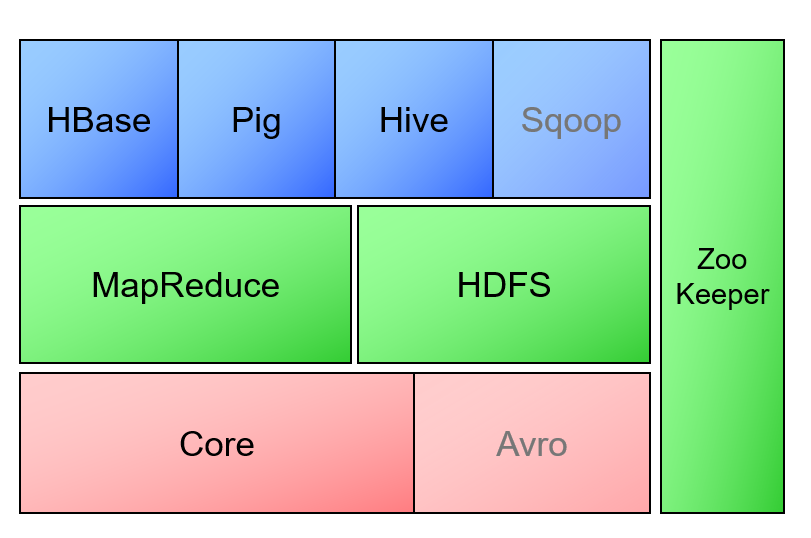

## 五. Hadoop -> Store 

1. NameNode：Managing FsImage file and EditLog file to manage meta info
   - FsImage：Block mapping info
   - EditLog：used to update FsImage according to HeartBeat and BlockReport strategy
   - HA：Standby/Active NameNode

2. DataNode：
   - Store data
   - Block operation

## 六. MapReduce

1. procedure：

    
  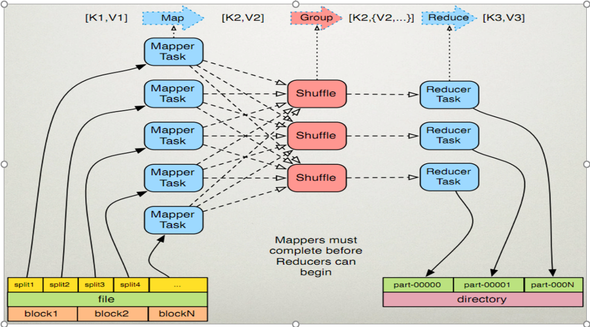

2. write Map/Reduce function

## 七. Spark concept/RDD

- parallelize a collection
- read data from external source
- **all transformations in Spark are lazy**
- **actions**

## 八. Mapreduce VS Spark

MapReduce：

- Great **at one-pass** computation, but inefficient for *multi-pass* algorithms
- No efficient primitives for data sharing

Spark：

- Extends a programming language with **a distributed collection data-structure（RDD）**
- Clean APIs in Java,Scala,Python,R

