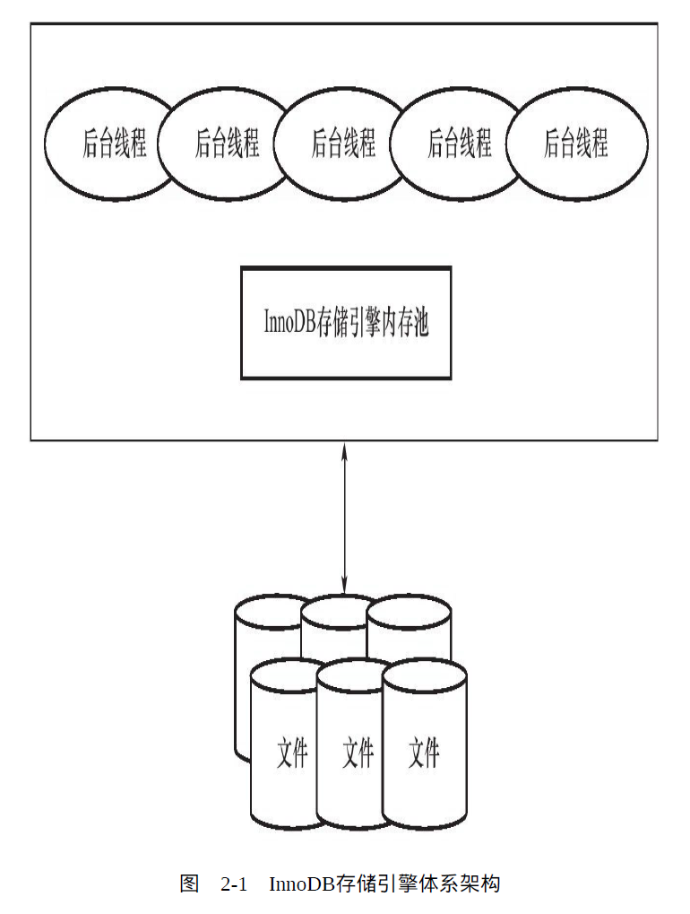
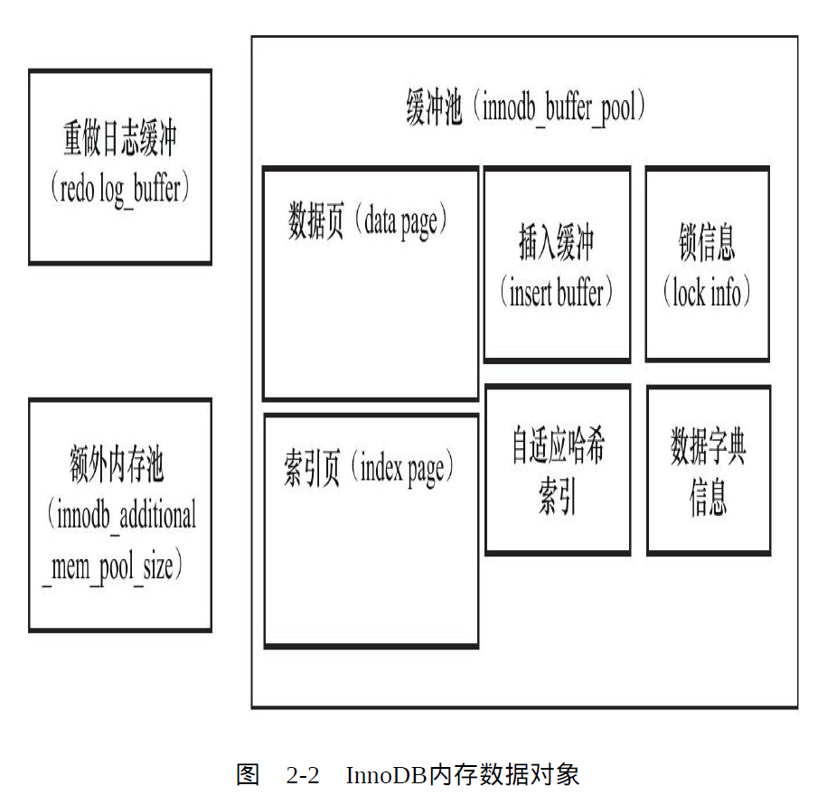

[TOC]

# 一. MySQL体系结构和存储引擎

## 1.1 MySQL体系结构

**数据库与实例：**

> 从概念上来说，数据库是文件的集合，是依照某种数据模型组织起来并存放于二级存储器中的数据集合；数据库实例是程序，是位于用户与操作系统之间的一层数据管理软件，用户对数据库数据的任何操作，包括数据库定义、数据查询、数据维护、数据库运行控制等都是在数据库实例下进行的，应用程序只有通过数据库实例才能和数据库打交道，连接MySQ操作是一个连接进程和MySQ数据库实例进行通信，本质上是进程间通信

MySQL**插件式的存储引擎架构**提供了一系列标准的管理和服务支持，这些标准与存储引擎本身无关，可能是每个数据库系统本身都必需的，如SQL分析器和优化器等。而**存储引擎是底层物理结构的实现**，每个存储引擎开发者可以按照自己的意愿来进行开发。**存储引擎是基于表的，而不是数据**。

## 1.2 InnoDB存储引擎

由于MySQL数据库开源特性，存储引擎可以分为**MySQL官方存储引擎**和**第三方存储引擎**
**InnoDB存储引擎**是MySQL数据库OLTP（Online Transaction Processing在线事务处理）应用中**使用最广泛的存储引擎**

InnoDB存储引擎**特点：**行锁设计、支持外键，并支持类似于Oracle的非锁定读，即默认读取操作不会产生锁

对于表中数据的存储，InnoDB存储引擎采用了**聚集（clustered）**的方式，因此每张表的存储都是按**主键的顺序**进行存放。如果没有显式地在表定义时指定主键，InnoDB存储引擎会为每一行生成一个**6字节的ROWID**，并以此作为**主键**。

InnoDB支持**全文索引、事务**、可以通过**SHOW ENGINES的MySQL语句**查看当前使用数据库所支持的存储引擎

## 1.3 连接MySQL

- TCP/IP套接字：两台机器通过一个TCP/IP网络连接，例如用户可以在Windows服务器下请求一台远程
  Linux服务器下的MySQL实例
- Unix域套接字：其实不是一个网络协议，所以只能在客户端和数据库实例在一台服务器上的情况下使用

# 二. InnoDB存储引擎

## 2.1 概述

- 该存储引擎是第一个完整支持ACID事务的MySQL存储引擎
  其特点是行锁设计、支持MVCC、支持外键、提供一致性非锁定读
  同时被设计用来最有效地利用以及使用内存和CPU

- 从**MySQL 5.1版本**开始，MySQL数据库允许存储引擎开发商以**动态方式加载引擎**，这样存储引
  擎的更新可以不受MySQL数据库版本的限制。所以在MySQL 5.1中，可以支持两个版本的InnoDB，一个是静态编译的InnoDB版本，可将其视为老版本的InnoDB；另一个是动态加载的InnoDB版本，官方称为
  InnoDB Plugin，可将其视为InnoDB 1.0.x版本。MySQL 5.5版本中又将InnoDB的版本升级到了1.1.x。而在最近的**MySQL 5.6版本中InnoDB的版本也随着升级为1.2.x版本**。

## 2.2 体系结构

    

- 后台线程

  InnoDB存储引擎是**多线程的模型**

  1. Master Thread

     Master Thread是一个非常核心的后台线程，主要负责**将缓冲池中的数据异步刷新到磁盘，保证数据的一致性**，包括脏页的刷新、合并插入缓冲(INSERT BUFFER）、UNDO页的回收等

  2. IO Thread

     **负责AIO请求的回调处理**

  3. Purge Thread

     **事务被提交后，回收已经使用并分配的undo页**。从1.1版本开始，purge操作可以独立到单独的线程中进行，减轻Master Thread的工作，**innodb_purge_thread=1**，从InnoDB 1.2版本开始, InnoDB支持多个Purge Thread ,这样做的目的是为了 进一步加快undo页 的回收

  4. Page Cleaner Thread

     **将之前版本中脏页的刷新操作都放入到单独的线程中来完成**，目的是为了减轻原Master Thread的工作及对于用户查询线程的阻塞

- 内存

  1. 缓冲池

     InnoDB存储引擎是**基于磁盘存储**的，并将其中的记录**按照页的方式**进行管理

     缓冲池简单说就是一块**内存区域**，对于数据库中页的修改操作，则首先修改在缓冲池中的页，然后再以
     **Checkpoint的机制刷新到磁盘**上

     缓冲池中大部分为索引页与数据页，也包括undo页、插入缓冲、自适应哈希索引等 

  
    
  
  

   	 从InnoDB 1.0.x版本开始，**允许有多个缓冲池实例**，每个页根据**哈希值平均分配**到不同缓冲池实例中

  ​	  通过命令**SHOW ENGINE INNODB STATUS**可以观察到每个缓冲池实例对象运行的状态

  2. LRU List、Free List、Flush List

     数据库中的缓冲池是通过**LRU（Latest Recent Used，最近最少使用）算法**来进行管理的。即最频繁使用的页在LRU列表的前端，而最少使用的页在LRU列表的尾端。当缓冲池不能存放新读取到的页
     时，将首先释放LRU列表中尾端的页

     缓冲池中页的**大小默认为16KB**，InnoDB中的LRU算法不是将最新访问到的页放入列表首部，而是放入**midpoint**位置(差不多5/8的位置)，在midpoint前的列表成为**new**列表，之后的列表为**old**列表，midpoint位置可由参数innodb_old_blocks_pct控制

     

     

  3. 啊

  

  

  

